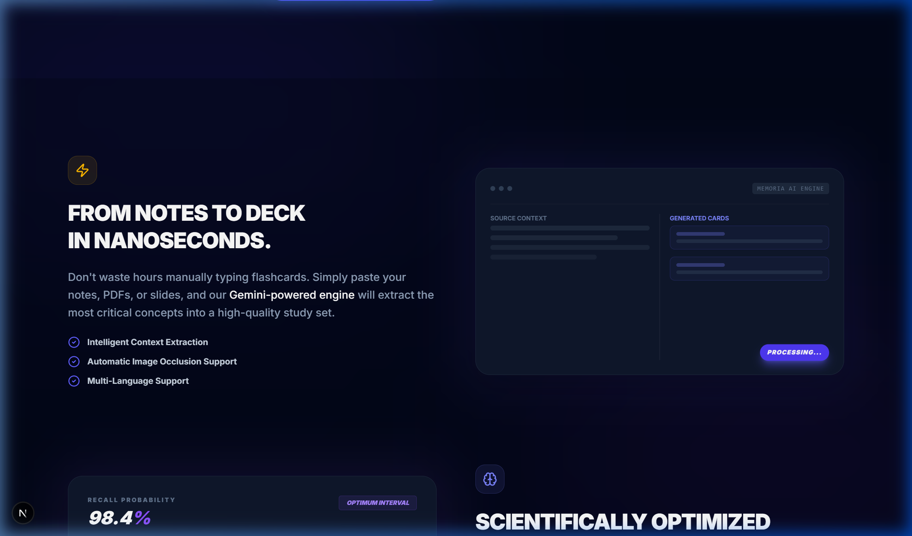
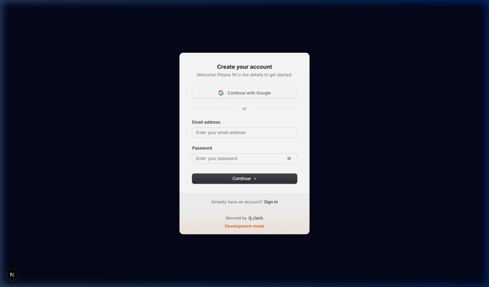
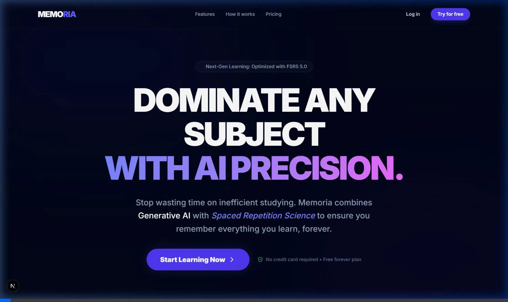

# Memoria: AI-First Next-Gen Scientific Learning Platform


Memoria is a high-performance, AI-driven study platform designed for the "agentic era." It combines the power of **Google Gemini 1.5 Flash** for automated content generation with the scientific precision of the **FSRS (Free Spaced Repetition Scheduler)** algorithm to optimize long-term memory retention.

## 🖼 Visual Showcase

### Interactive Hero & Landing Page
The landing page features high-impact typography and smooth animations to communicate the platform's value immediately.


### AI-Powered Preview Systems
The feature showcase includes animated mock UI components demonstrating the AI generation and scientific intervals.


### Authentication Flow
Seamless integration with Clerk for secure, role-based access.


### Full Technical Walkthrough
Watch the complete functional verification of the platform's features and navigation.


## 🚀 Vision
To build the most efficient learning engine on the planet, removing the friction of manual deck creation and providing a scientifically-backed study schedule that adapts to every user's unique memory profile.

## ✨ Key Features

### 1. Magic Generate (AI Engine)
- **Zero-Friction Creation**: Paste notes, PDFs, or slides and watch Memoria's Gemini-powered engine extract core concepts into a 20-card deck in seconds.
- **Contextual Understanding**: Handles complex hierarchies and provides high-quality questions and answers automatically.

### 2. Study Engine (FSRS 5.0)
- **Scientific Scheduling**: Uses the state-of-the-art FSRS algorithm to predict your forgetfulness curve.
- **Adaptive Difficulty**: Cards are scheduled based on your feedback: *Again, Hard, Good, Easy*.
- **3D Interactive Cards**: Premium study experience with 3D-flip animations and glassmorphism UI.

### 3. Gamification & Engagement
- **Global Leaderboard**: Compete with students worldwide.
- **Streak System**: Visualize your consistency with a dynamic 7-day streak tracker.
- **Analytics**: Deep-dive into your retention rates and memory stability.

### 4. Admin Command Center
- **Total Control**: High-level dashboard for managing users, monitoring AI token usage, and overseeing system health.

## 🛠 Tech Stack

- **Frontend**: [Next.js 16](https://nextjs.org/) (App Router), [Tailwind CSS 4](https://tailwindcss.com/), [Framer Motion](https://www.framer.com/motion/)
- **Backend**: [PostgreSQL](https://www.postgresql.org/), [Prisma ORM](https://www.prisma.io/)
- **Authentication**: [Clerk](https://clerk.com/) (Role-Based Access Control)
- **AI**: [Google Gemini 1.5 Flash](https://deepmind.google/technologies/gemini/)
- **Algorithm**: [FSRS (ts-fsrs)](https://github.com/open-spaced-repetition/ts-fsrs)
- **Data Viz**: [Recharts](https://recharts.org/), [TanStack Table](https://tanstack.com/table)

## 📦 Getting Started

### Prerequisites
- Node.js 18+ 
- PostgreSQL database (Supabase or local)

### Installation

1. **Clone the repository**
   ```bash
   git clone https://github.com/your-username/memoria.git
   cd memoria
   ```

2. **Install dependencies**
   ```bash
   npm install
   ```

3. **Environment Setup**
   Create a `.env` file in the root directory. You can use the following table as a reference for required keys:

| Variable | Description | Source |
| :--- | :--- | :--- |
| `DATABASE_URL` | PostgreSQL connection string | Supabase / local Postgres |
| `NEXT_PUBLIC_CLERK_PUBLISHABLE_KEY` | Clerk Frontend API key | [Clerk Dashboard](https://dashboard.clerk.com) |
| `CLERK_SECRET_KEY` | Clerk Backend API key | [Clerk Dashboard](https://dashboard.clerk.com) |
| `GEMINI_API_KEY` | Google Gemini API key | [Google AI Studio](https://aistudio.google.com/) |

4. **Database Migration**
   ```bash
   npx prisma migrate dev
   ```

5. **Run Development Server**
   ```bash
   npm run dev
   ```

## 🔮 Roadmap & Future Scope

Memoria is just getting started. Here’s what we’re planning for the future:

### 1. Advanced AI Capabilities
- **Multimedia Generation**: Support for generating cards from YouTube videos, local audio files, and handwriting recognition (OCR).
- **AI Tutors**: Personalized AI chatbots that can explain concepts you’re struggling with based on your FSRS history.

### 2. Social & Collaborative Learning
- **Deck Marketplace**: A community hub to share, rate, and clone high-quality study sets.
- **Study Groups**: Real-time collaborative sessions with synchronized flashcard reviews.

### 3. Cross-Platform Experience
- **Mobile App**: Dedicated iOS and Android applications built with React Native.
- **Offline Mode**: Local-first sync capability to study anywhere without an internet connection.

### 4. Advanced Analytics
- **Projected Mastery**: Better visualization for when you will reach "Mastery" of a subject based on your current stability.
- **Heatmaps**: GitHub-style contribution heatmaps for study consistency.

## 🏗 Architecture
- `app/`: Next.js App Router pages and API routes.
- `components/`: Reusable UI components (shadcn/ui based).
- `lib/`: Core logic, FSRS implementation, and AI actions.
- `prisma/`: Database schema and migrations.

## 🚀 Deployment

Memoria is optimized for deployment on the [Vercel Platform](https://vercel.com/new).

### 1. Connect to GitHub
- Select the `memoria` repository in the Vercel dashboard.
- Ensure the Framework Preset is set to **Next.js**.

### 2. Environment Variables
Add the following keys in the "Environment Variables" section during setup:

| Key | Description |
| :--- | :--- |
| `DATABASE_URL` | Your production PostgreSQL connection string. |
| `NEXT_PUBLIC_CLERK_PUBLISHABLE_KEY` | Your Clerk Publishable Key. |
| `CLERK_SECRET_KEY` | Your Clerk Secret Key. |
| `GEMINI_API_KEY` | Your Google Gemini API Key. |
| `NEXT_PUBLIC_CLERK_SIGN_IN_URL` | `/sign-in` |
| `NEXT_PUBLIC_CLERK_SIGN_UP_URL` | `/sign-up` |

### 3. Build & Launch
Click **Deploy**. Vercel will trigger a production build, run the Prisma post-install generation, and provide your live application URL.

## 🤝 Contributing

We welcome contributions! 

1. **Fork** the repository.
2. **Create** a new feature branch (`git checkout -b feature/AmazingFeature`).
3. **Commit** your changes (`git commit -m 'Add some AmazingFeature'`).
4. **Push** to the branch (`git push origin feature/AmazingFeature`).
5. **Open** a Pull Request.

## 📜 License
MIT License. Built with ❤️ for the future of learning.

## 📬 Contact
Project Link: [https://github.com/ahadbd/memoria](https://github.com/ahadbd/memoria)
