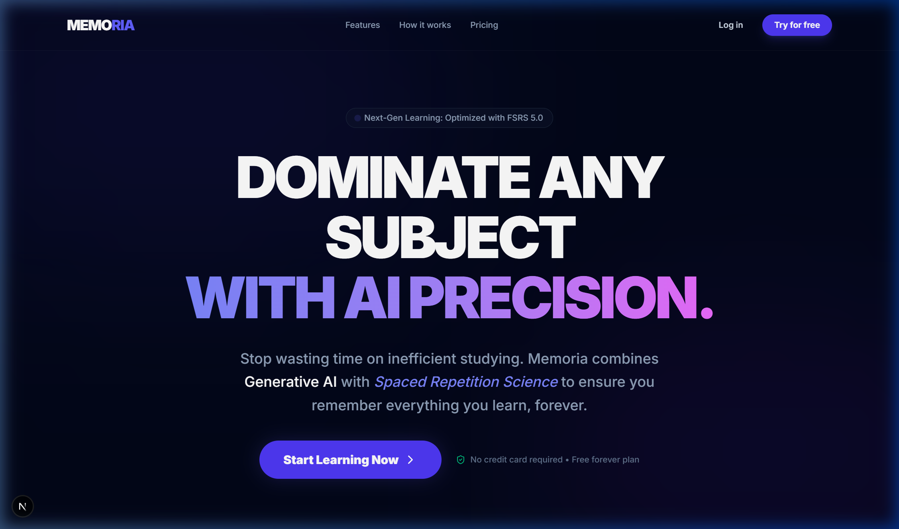

# Memoria: AI-First Spaced Repetition Platform


Memoria is a high-performance, AI-driven study platform designed for the "agentic era." It combines the power of **Google Gemini 1.5 Flash** for automated content generation with the scientific precision of the **FSRS (Free Spaced Repetition Scheduler)** algorithm to optimize long-term memory retention.

## 🖼 Visual Showcase

### Interactive Hero & Landing Page
The landing page features high-impact typography and smooth animations to communicate the platform's value immediately.


### AI-Powered Preview Systems
The feature showcase includes animated mock UI components demonstrating the AI generation and scientific intervals.


### Authentication Flow
Seamless integration with Clerk for secure, role-based access.


### Full Technical Walkthrough
Watch the complete functional verification of the platform's features and navigation.


## 🚀 Vision
To build the most efficient learning engine on the planet, removing the friction of manual deck creation and providing a scientifically-backed study schedule that adapts to every user's unique memory profile.

## ✨ Key Features

### 1. Magic Generate (AI Engine)
- **Zero-Friction Creation**: Paste notes, PDFs, or slides and watch Memoria's Gemini-powered engine extract core concepts into a 20-card deck in seconds.
- **Contextual Understanding**: Handles complex hierarchies and provides high-quality questions and answers automatically.

### 2. Study Engine (FSRS 5.0)
- **Scientific Scheduling**: Uses the state-of-the-art FSRS algorithm to predict your forgetfulness curve.
- **Adaptive Difficulty**: Cards are scheduled based on your feedback: *Again, Hard, Good, Easy*.
- **3D Interactive Cards**: Premium study experience with 3D-flip animations and glassmorphism UI.

### 3. Gamification & Engagement
- **Global Leaderboard**: Compete with students worldwide.
- **Streak System**: Visualize your consistency with a dynamic 7-day streak tracker.
- **Analytics**: Deep-dive into your retention rates and memory stability.

### 4. Admin Command Center
- **Total Control**: High-level dashboard for managing users, monitoring AI token usage, and overseeing system health.

## 🛠 Tech Stack

- **Frontend**: [Next.js 16](https://nextjs.org/) (App Router), [Tailwind CSS 4](https://tailwindcss.com/), [Framer Motion](https://www.framer.com/motion/)
- **Backend**: [PostgreSQL](https://www.postgresql.org/), [Prisma ORM](https://www.prisma.io/)
- **Authentication**: [Clerk](https://clerk.com/) (Role-Based Access Control)
- **AI**: [Google Gemini 1.5 Flash](https://deepmind.google/technologies/gemini/)
- **Algorithm**: [FSRS (ts-fsrs)](https://github.com/open-spaced-repetition/ts-fsrs)
- **Data Viz**: [Recharts](https://recharts.org/), [TanStack Table](https://tanstack.com/table)

## 📦 Getting Started

### Prerequisites
- Node.js 18+ 
- PostgreSQL database (Supabase or local)

### Installation

1. **Clone the repository**
   ```bash
   git clone https://github.com/your-username/memoria.git
   cd memoria
   ```

2. **Install dependencies**
   ```bash
   npm install
   ```

3. **Environment Setup**
   Create a `.env` file in the root directory:
   ```env
   DATABASE_URL="postgresql://..."
   NEXT_PUBLIC_CLERK_PUBLISHABLE_KEY="pk_test_..."
   CLERK_SECRET_KEY="sk_test_..."
   GEMINI_API_KEY="AIza..."
   ```

4. **Database Migration**
   ```bash
   npx prisma migrate dev
   ```

5. **Run Development Server**
   ```bash
   npm run dev
   ```

## 🏗 Architecture
- `app/`: Next.js App Router pages and API routes.
- `components/`: Reusable UI components (shadcn/ui based).
- `lib/`: Core logic, FSRS implementation, and AI actions.
- `prisma/`: Database schema and migrations.

## 📜 License
MIT License. Built with ❤️ for the future of learning.
